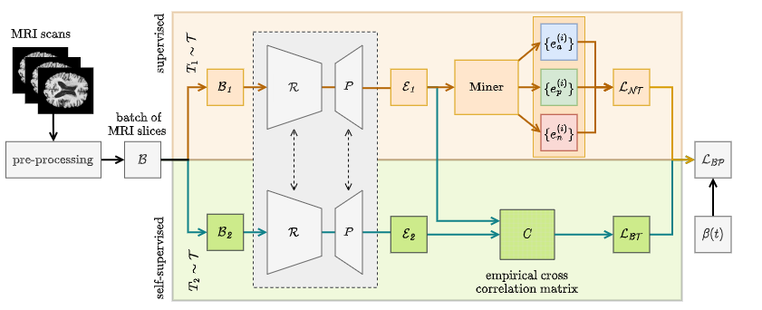

<h1 align="center">
  <br>
  DeepBrainPrint
  <br>
</h1>

<h4 align="center">Identifying Individuals Exploiting a Semi-Self-Supervised Contrastive Framework Trained for Structural MRIs.</h4>

<!-- <p align="center">
  <a href="https://www.paypal.me/AmitMerchant">
    
  </a>
</p> -->

<p align="center">
  <a href="#abstract">Abstract</a> •
  <a href="">Arxiv.org</a> •
  <a href="#installation">Installation</a> •
    <a href="#how-to-use">How To Use</a> •
    <a href="#training">Training</a> •
  <a href="#cite">Cite</a> •
</p>




## Abstract

Medical imaging datasets are growing in size due to the widespread use of MRI scanners. With the increase in data volume, it has become difficult to find relevant information within these datasets. To address this challenge, we are developing an AI-powered medical imaging retrieval system designed to search for similar brain MRI scans within a large dataset (i.e. find other brain scans from the same individual). Our approach, called DeepBrainPrint, is a semi-self-supervised contrastive deep learning framework with three main innovations. First, we combine a self-supervised and a supervised framework to create an effective brain fingerprint from MRI scans that is useful for real-time image retrieval. Second, we train our system using a weighting function that controls the importance of each of these two frameworks during training and improves training convergence. Third, we propose a set of new imaging transformations to enhance retrieval robustness to intensity variations (e.g., scans with different contrasts) and age and disease progression in patients. We have validated our system on a large dataset of T1-weighted brain MRIs from the Alzheimer's Disease Neuroimaging Initiative (ADNI) and on a synthetic dataset designed to verify the retrieval performance on different image modalities. Our solution outperforms previous methods, including simple similarity metrics and more advanced contrastive deep learning frameworks for image retrieval. We believe that our approach has applications in many clinical scenarios that require data organization or searching for similar MRI scans.

## Installation

Download and install `Anaconda` or `miniconda` from the [official website](https://www.anaconda.com/products/distribution). Make it works by opening a shell and running:

```bash
$ conda env list
```

This should prompt the list of your conda environments. Now create a new environment: 

```bash
$ conda create -n deepbrainprint python=3.9
```

And activate the new env:

```bash
$ conda activate deepbrainprint
```

Finally, clone the repository and install the `deepbrainprint` package running the following inside the project folder:

```bash
$ pip install -e .
```

## How To Use

If you want to use our entire pipeline, or just pieces of it, please install our library by running: 

```bash
pip install deepbrainprint
```

Then you can use our modules: 

| CLASS / FUNCTION                                       | DESCRIPTION                                                  |
| ------------------------------------------------------ | ------------------------------------------------------------ |
| `deepbrainprint.model.encoder`                             | Implements the encoder $\mathcal R$                          |
| `deepbrainprint.model.ProjectionHead`                      | Implements the projection head $P$                           |
| `deepbrainprint.model.Embedder`                            | Implements the model $\mathcal M$                            |
| `deepbrainprint.loss.DeepBrainPrintLoss`                       | Implements the loss $\mathcal{L_{BT}}$                       |
| `deepbrainprint.beta_scheduler.LinearBetaScheduler`        | Implements the linear decrease function $\beta(t)$           |
| `deepbrainprint.optim.LARS`                                | Implements the LARS optimizer                                |
| `deepbrainprint.lr_scheduler.CosineAnnealingWarmup`        | Implements the cosine annealing scheduler + linear warmup    |
| `deepbrainprint.dataset.ADNI2D`                            | Implements the interface forADNI and SYNT-CONTR datasets     |
| `deepbrainprint.dataset.AugmentedPairWrapper`              | Returns 2 different transformed versions of the image        |
| `deepbrainprint.augmentation.domain_specific_augmentation` | Returns the domain specific set of transformations distributed by $\mathcal T$ |
| `deepbrainprint.sampler.single_scan_x_followup`            | Sampling described in Section 3. - Dataset                   |

You can find the semi-hard negative miner implemented in [pytorch-metric-learning](https://github.com/KevinMusgrave/pytorch-metric-learning) (`pytorch_metric_learning.miners.BatchEasyHardMiner `).


## Training

After installating the package, you can train the pipeline using `train.py`:

```bash
python train.py --help
usage: train.py [-h] [--exp-name EXP_NAME] [--dataset-dir DATASET_DIR] [--output-dir OUTPUT_DIR] [--epochs EPOCHS] [--batch-size BATCH_SIZE] [--workers WORKERS] [--pin-memory PIN_MEMORY]
                [--cuda CUDA] [--sched SCHED] [--sched-hp SCHED_HP] [--data-mean DATA_MEAN] [--data-std DATA_STD]

optional arguments:
  -h, --help                  show this help message and exit
  --exp-name EXP_NAME         output dir name
  --dataset-dir DATASET_DIR   ADNI dataset dir
  --output-dir OUTPUT_DIR     output dir
  --epochs EPOCHS             number of training epochs
  --batch-size BATCH_SIZE     batch size
  --workers WORKERS           dataloaders workers
  --pin-memory PIN_MEMORY     pin memory (GPU)
  --cuda CUDA                 train on GPU
  --sched SCHED               weighting function (see paper appendix B.1)
  --sched-hp SCHED_HP         optional scheduler hyperparameter
  --data-mean DATA_MEAN       ADNI dataset mean
  --data-std DATA_STD         ADNI dataset std
```

That will produce an output directory containing the trained model. To evaluate the model, use `eval.py`:

```bash
python eval.py --help
usage: eval.py [-h] --exp-dir EXP_DIR --adni-dir ADNI_DIR --synt-dir SYNT_DIR [--cuda CUDA] [--best BEST]

optional arguments:
  -h, --help           show this help message and exit
  --exp-dir EXP_DIR    Experiment output from train.py
  --adni-dir ADNI_DIR  ADNI dataset dir
  --synt-dir SYNT_DIR  SYNT-CONTR dataset dir
  --cuda CUDA          run evaluation on GPU
  --best BEST          evaluate the model with lowest validation loss
```


## Cite

[DeepBrainPrint paper]():
```
<add bib citation here>
```
